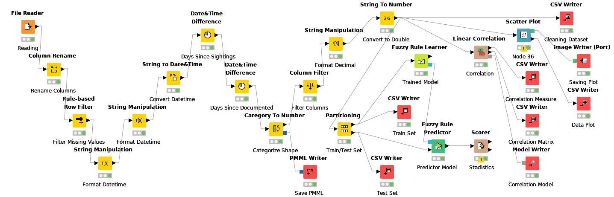

# Shape UFO Sightings Prediction

This project is a test to see how Knime works and how to create a workflow, it doesn't have any real application more than practice and fun. **Model Accuracy: ~15%**



Model to predict the shape of an UFO Sightings using Knime Software and Fuzzy Rules Model.

Dataset provided by [Kaggle](https://www.kaggle.com/camnugent/ufo-sightings-around-the-world)

## Structure

```
.
├── .artifacts/
├── CSV Writer (#13)/
├── CSV Writer (#14)/
├── CSV Writer (#15)/
├── CSV Writer (#32)/
├── CSV Writer (#33)/
├── CSV Writer (#37)/
├── Category To Number (#28)/
├── Column Filter (#16)/
├── Column Rename (#17)/
├── Date_Time Difference (#25)/
├── Date_Time Difference (#26)/
├── File Reader (#1)/
├── Fuzzy Rule Learner (#44)/
├── Fuzzy Rule Predictor (#45)/
├── Image Writer _Port_ (#7)/
├── Linear Correlation (#31)/
├── Model Writer (#34)/
├── PMML Writer (#30)/
├── Partitioning (#12)/
├── Rule_based Row Filter (#3)/
├── Scatter Plot (#36)/
├── Scorer (#39)/
├── String Manipulation (#21)/
├── String Manipulation (#23)/
├── String Manipulation (#35)/
├── String To Number (#27)/
├── String to Date_Time (#22)/
├── data
│   ├── Correlation/
│   │	├──  matrix.csv
│   │	├── measure.csv
│   │	└── model.zip
│   ├── PMML/
│   │	└── categories_shape.pmml
│   ├── cleaning_dataset.csv
│   ├── scatter_data_plot.csv
│   ├── test_set.csv
│   ├── train_set.csv
│   └── ufo_sighting_data.csv
├── images/
│   ├── correlation_matrix.vsg
│   └── scatter_plot.svg
├── .savedWithData
├── README.md
├── workflow.knime
├── workflow.svg

```
